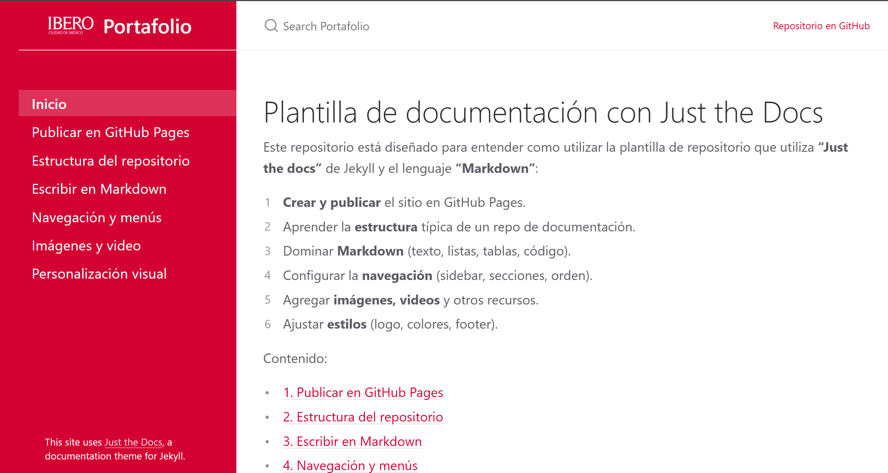

# Estructura del repositorio

En este curso trabajaremos **solo con GitHub Pages + Codespaces**. La meta es que tu repositorio tenga una estructura predecible:

- sabes **dónde editar contenido**,
- sabes **dónde guardar recursos** (imágenes y PDFs),
- y entiendes **por qué una página sí o no aparece en el menú**.

---

## 1) Mapa rápido del repositorio (la estructura que usaremos)

```text
.
├─ _config.yml
├─ README.md
├─ index.md
├─ 01-publicar-en-github-pages.md
├─ 02-estructura-del-repo.md
├─ 03-markdown.md
├─ 04-navegacion.md
├─ 05-media.md
├─ 06-estilos.md
├─ _includes/
│  ├─ head_custom.html
│  └─ footer_custom.html
└─ assets/
   ├─ css/
   │  └─ custom.css
   ├─ img/
   │  ├─ logotipo.png
   │  └─ (tus imagenes)
   └─ files/
      └─ (tus PDFs)
```

### ¿Qué hace cada cosa? (en una frase)

- **`_config.yml`**: configuración del sitio (titulo, url/baseurl, tema, opciones).
- **`README.md`**: instrucciones para humanos (como clonar/fork, como publicar).
- **`index.md`**: portada del sitio (Home).
- **`*.md`**: páginas del sitio (cada tema o sección).
- **`_includes/`**: piezas HTML que se “inyectan” (header/footer y extras).
- **`assets/`**: recursos estáticos (CSS, imágenes, PDFs).

> Regla práctica: en clase, casi todo lo que edites será **`.md`** y **`assets/`**.

---

## 2) Qué ocurre cuando haces commit y push (el ciclo completo)

Cuando editas en Codespaces y haces **Commit** + **Push**:

1. Se suben tus archivos a GitHub (rama `main`).
2. Se dispara un flujo automático (GitHub Actions) para construir el sitio.
3. GitHub Pages publica la versión nueva.
4. Tu URL se actualiza.

**Dónde verificar que ya quedó:**

- **Actions** (ver si está “verde/success”).
- **Settings → Pages** (ver la URL y el estado de publicación).

**Figura 11 (pendiente):** Ejecución en Actions (verde).  


---

## 3) Qué editar normalmente (y qué NO tocar)

### Editas con frecuencia

- `index.md` (portada).
- Cualquier página `*.md` (tus temas).
- `assets/img/` (imágenes del curso/documentación).
- `assets/files/` (PDFs, hojas de datos, entregables).
- `_config.yml` (solo algunos campos; en especial `url` y `baseurl`).

### Rara vez editas (solo si necesitas cambiar estilos)

- `_includes/head_custom.html` y `_includes/footer_custom.html` (para personalización visual).
- `assets/css/custom.css` (Colores de barra de navegación, texto, icono, titulo)

---

## 4) Front matter: por qué una página aparece en el menú

Just the Docs usa un bloque YAML al inicio de cada `.md` llamado **front matter**.  
Sin front matter, la página puede existir, pero normalmente no queda bien integrada al sitio.

Plantilla mínima recomendada:

```yml
---
layout: default
title: Mi pagina
nav_order: 10
---
```

- `title`: lo que verás en el menú.
- `nav_order`: el orden en el menú.
- `layout: default`: estándar para páginas del curso.

**Figura 12 (pendiente):** Menú lateral mostrando el orden `nav_order`.  


### Secciones con subpáginas (padre/hijas)

**Padre (sección):**

```yml
---
layout: default
title: Unidad 2
nav_order: 20
has_children: true
---
```

**Hija (subpágina):**

```yml
---
layout: default
title: Subtema 2.1
parent: "Unidad 2"
nav_order: 1
---
```

Reglas importantes:

- El `parent` debe coincidir **exactamente** con el `title` del padre.
- Mantén máximo **2 niveles** (padre → hijas). Más niveles complica navegación y mantenimiento.

---

## 5) Convenciones recomendadas

- **Nombres de archivo**: minúsculas + guiones  
  `mi-primer-apunte.md`, `sensores-de-temperatura.md`
- Evita espacios, acentos y símbolos en nombres de archivo.
- **Un tema por página** (no mezcles 5 temas en un solo `.md`).
- Mantén tu repo ordenado: imágenes en `assets/img/`, PDFs en `assets/files/`.

> Nota: GitHub Pages distingue mayúsculas/minúsculas en rutas. `Foto.png` y `foto.png` NO son lo mismo.

---

## 6) Dónde guardar recursos (imágenes y PDFs)

### Imágenes

Guárdalas aquí:
- `assets/img/`

Ejemplo de uso en Markdown:

```md

```

### PDFs u otros archivos descargables

Crea/usa:
- `assets/files/`

Ejemplo de link:

```md
[Descargar hoja de datos](assets/files/datasheet-sensor.pdf)
```

---

---

## 7) Problemas típicos y soluciones rápidas

- **La página no aparece en el menú**
  - Revisa que tenga front matter.
  - Revisa `title` y `nav_order`.
  - Si es hija: revisa que `parent` coincida con el `title` del padre.

- **Las imágenes no cargan**
  - Revisa ruta: `assets/img/...`
  - Revisa mayúsculas/minúsculas del nombre del archivo.
  - Revisa que la imagen esté realmente en el repo (commit + push).

- **El sitio carga, pero “sin estilos”**
  - Suele ser `baseurl` incorrecto en `_config.yml`.
  - Verifica que `url` y `baseurl` correspondan a tu usuario y nombre de repo.

---

## Siguiente tema

[Escritura en Markdown](03-markdown.md)
